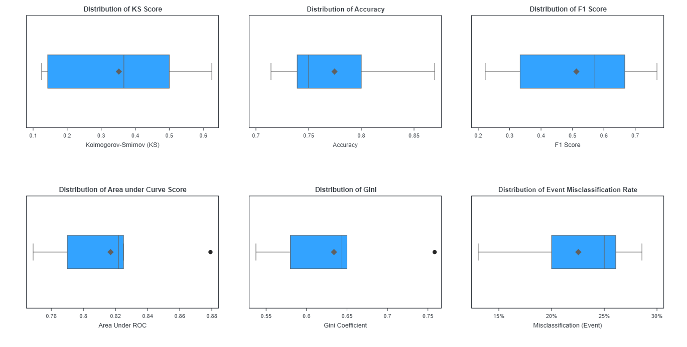

# Using K-Fold Cross Validation for Assessing Goodness of Fit on Validation Data in SAS Viya
This repository gives a simple example of using the 'Sampling' CAS Actionset to perform K-Fold partitions on a hold-out dataset in order to use PROC ASSESS over each partition to review estimated goodness of fit. 

This repository includes a SAS script, the HMEQ.csv dataset, a SAS Notebook that can be ran using the VSCode SAS Extension and examples of ODS output using the PDF and HTML destinations.

